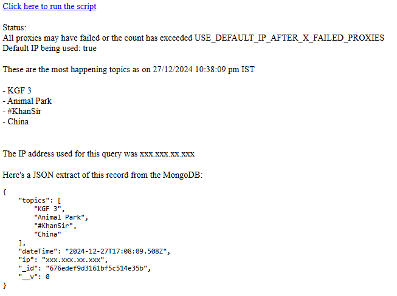

# STIR task
Scrap trending topics title and stores them in MongoDB


## Screenshot
After fetching screenshot



## Requirements
`-` Node.js


## Installation
`1.` Clone the respository

`2.` Open CLI
```bash
npm install
```

`3.` Fill the .env variables

`4.` Start the server
```bash
npm run start
```